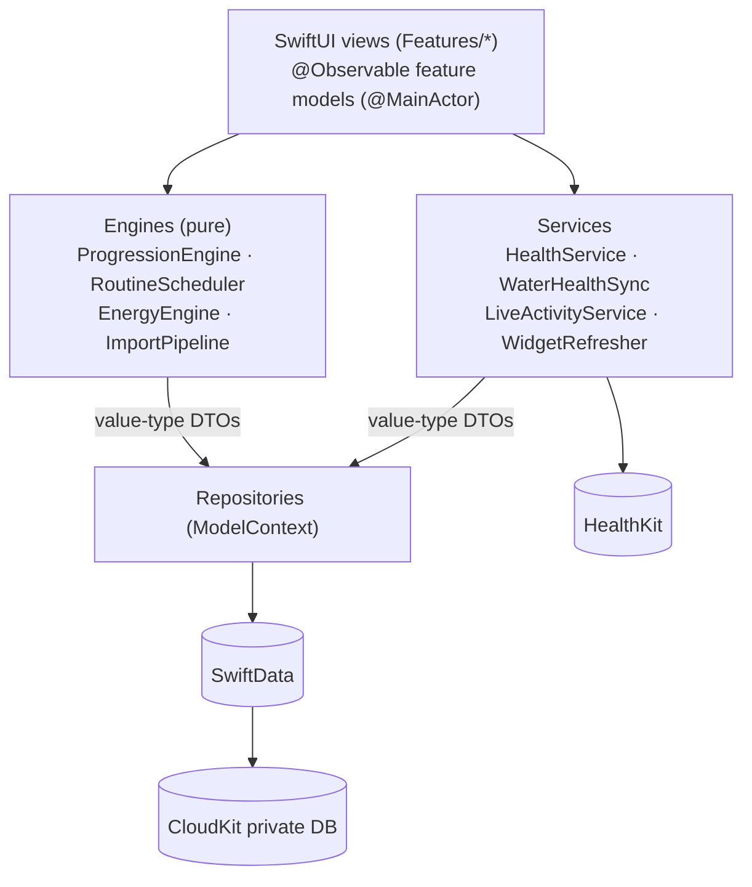

# Architecture

## Modules

| Module | Kind | Contents |
| --- | --- | --- |
| `Peak` | App target (`Peak.xcodeproj`) | SwiftUI views, feature models, app entry point, resources |
| `PeakCore` | Library (`Packages/PeakKit`) | SwiftData models, DTOs, engines, import/export, HealthKit service, repositories |
| `PeakDesign` | Library (`Packages/PeakKit`) | Design tokens, glass primitives, shared components |
| `PeakWidgets` | Widget extension (planned, F9) | Widgets and the Live Activity; depends on `PeakCore` and `PeakDesign` |

The app is the only target that produces an `.app` bundle. `PeakKit` holds libraries only, so the app and the widget
extension can share the same code.

## Layers and data flow

**Rules**

- Engines never touch SwiftData. They take and return value types (struct DTOs), so they are fully unit-testable.
- Conversion between `@Model` types and DTOs happens at the repository boundary.
- Data read from HealthKit is never stored in SwiftData or CloudKit (see [HEALTHKIT.md](HEALTHKIT.md)).
- `HealthService` is a protocol in `PeakCore` with a `MockHealthService` for previews, tests and screenshots. The real
  `HealthKitService` lives in the app target (`Peak/Services/`), so the package still builds and tests on a Mac host.
  `HealthConnection` (`@Observable`) holds the access status and is shared through the environment.
- `DayPlanner` (`PeakCore/Home/`) is the bridge between SwiftData models and `RoutineScheduler` for the Home screen.
- Shared app objects go into the environment at the root: `SettingsStore`, `HealthConnection` and `WorkoutLauncher`
  (starts or reopens a workout; the root view presents its sheet).

## State and settings

- UI state uses Observation (`@Observable`) feature models on the main actor, not view models per screen.
- Settings live in `NSUbiquitousKeyValueStore` (synced across devices), mirrored to App Group `UserDefaults` so the
  widget extension can read them. The key-value store needs the iCloud capability (paid membership); until then,
  settings live in App Group `UserDefaults` only.

## Stack

| Layer | Technology |
| --- | --- |
| UI | SwiftUI, Liquid Glass (`glassEffect`, `GlassEffectContainer`, `.buttonStyle(.glass)`) |
| Persistence | SwiftData with `VersionedSchema` and `SchemaMigrationPlan` from the first release |
| Sync | CloudKit private database through SwiftData |
| Health | HealthKit |
| Widgets | WidgetKit with App Intents |
| Live Activity | ActivityKit with `LiveActivityIntent` |
| CSV | Apple `TabularData` |
| XLSX | Third-party reader, chosen in F7 |
| Tests | Swift Testing (unit), XCUITest (flows and accessibility audit) |

Decisions behind this structure: [adr/](adr/README.md).
